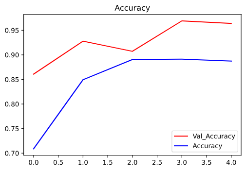
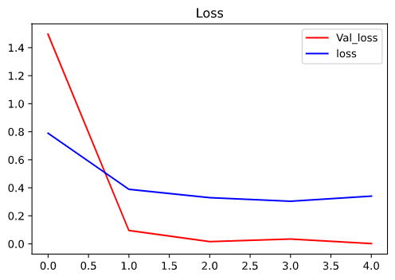

# Real-Time-Face-Mask-Detector

In order to protect ourselves from the COVID-19 Pandemic, almost every one of us tend to wear a face mask. It becomes increasingly necessary to check if the people in the crowd wear face masks in most public gatherings such as malls, theatres, parks, etc. The development of an AI solution to detect if the person is wearing a face mask and allow their entry would be of great help to the society. In this project, a simple Face Mask detection system is built using the Deep Learning technique called as Convolutional Neural Networks (CNN). This CNN Model is built using the TensorFlow framework and the OpenCV library which is highly used for real-time applications. This model can also be used to develop a full-fledged software to scan every person before they can enter the public gathering. Using this model, an accuracy of over 96% is obtained.

## Getting Started

### Dataset

The dataset can be downloaded from [here](https://drive.google.com/file/d/1xS7B1Co6EIV5HzsdNFPbYkoXdiBF2t_o/view?usp=sharing)

### Installation

1. Install the following libraries before running the project on your machine:

    * [Numpy](https://pypi.org/project/numpy/)
    * [Matplotlib](https://pypi.org/project/matplotlib/)
    * [Tensorflow](https://www.tensorflow.org/install)
    * [Keras](https://pypi.org/project/Keras/)
    * [OpenCV](https://pypi.org/project/opencv-python/)

1. [Download](https://github.com/smit-sms/Real-Time-Face-Mask-Detector/archive/master.zip) or Clone the project to your computer by using `git clone https://github.com/smit-sms/Real-Time-Face-Mask-Detector.git` on your terminal.

1. Navigate into the folder and run `python Detection.py` to see the project in action.

## Training Visualized

## Demo

## License

[MIT License](https://github.com/smit-sms/Real-Time-Face-Mask-Detector/blob/master/LICENSE)